# RL Stage2 曲线复盘

- 日志: `analysis/rl_stage2_from54132736_20260412/train_20260412_182837.log`
- train 记录数: 1734
- eval 记录数: 70
- 全程最高 eval success: 68.26% @ 0.07M frames
- 解冻后最高 eval success: 55.18% @ 6.62M frames
- 最新 eval success: 3.32% @ 113.12M frames, goal_reached=96.58%
- 最新 train success: 0.00% @ 114.00M frames, goal_reached=0.00%

## 曲线

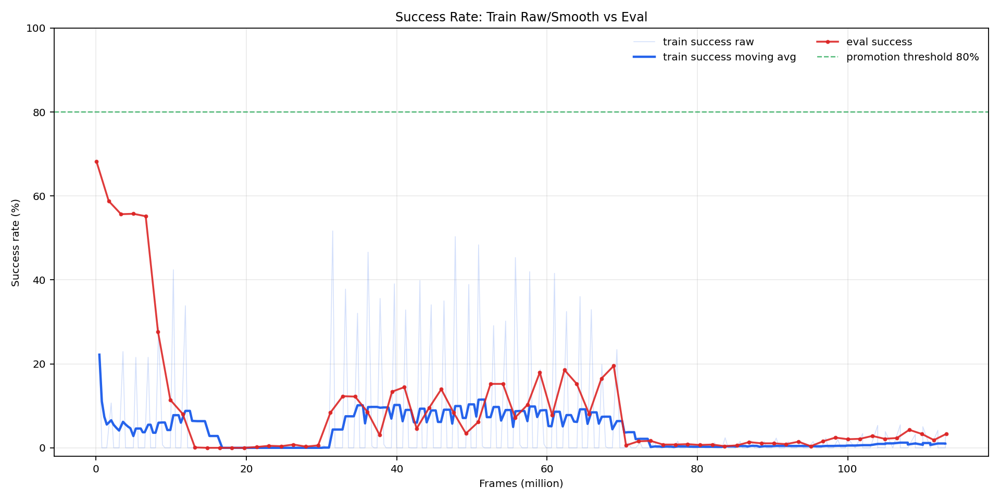

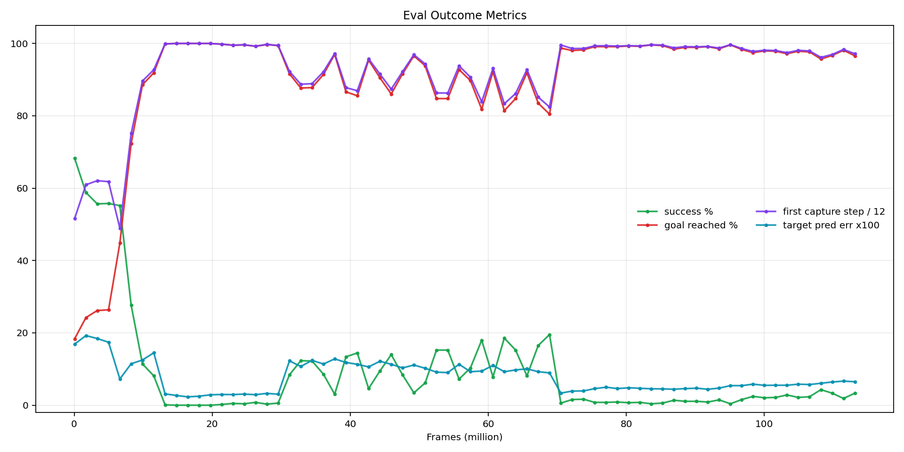

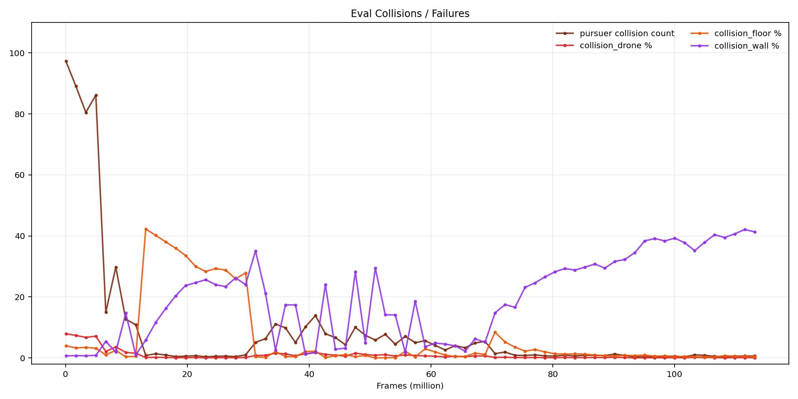

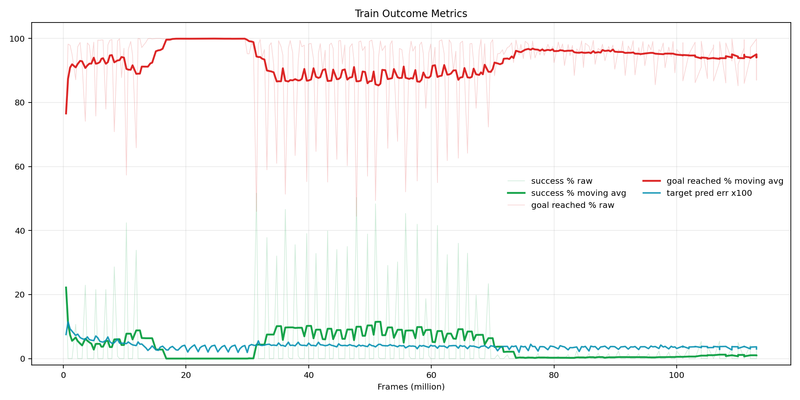

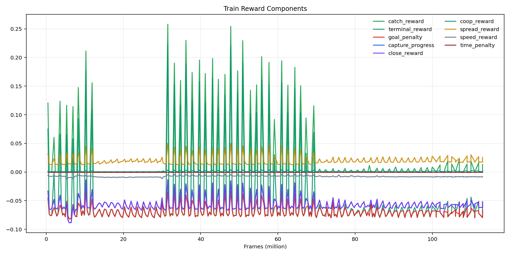

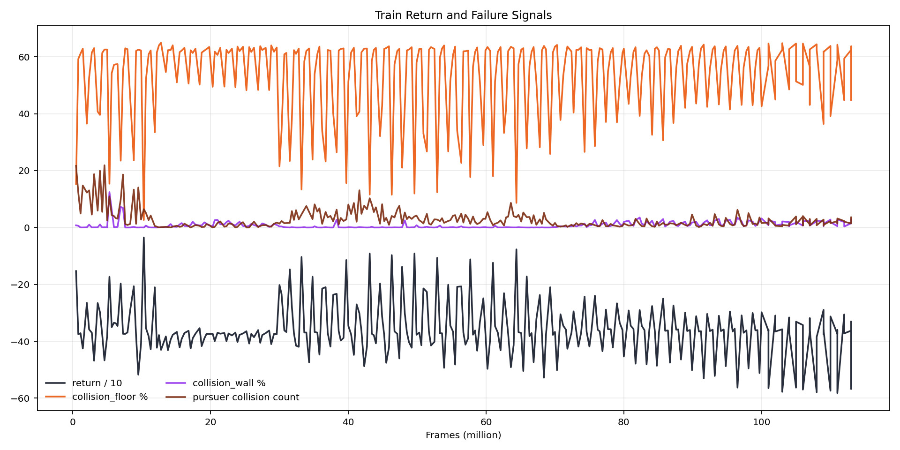

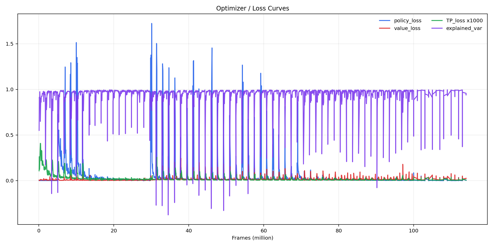

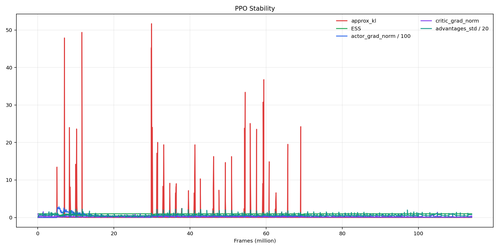

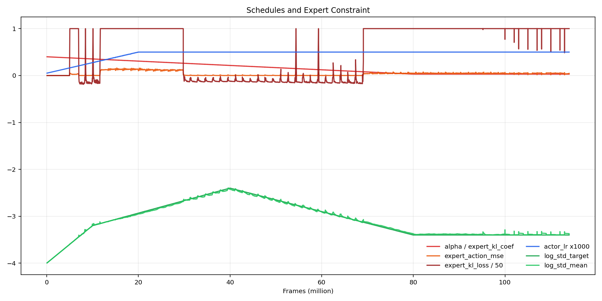

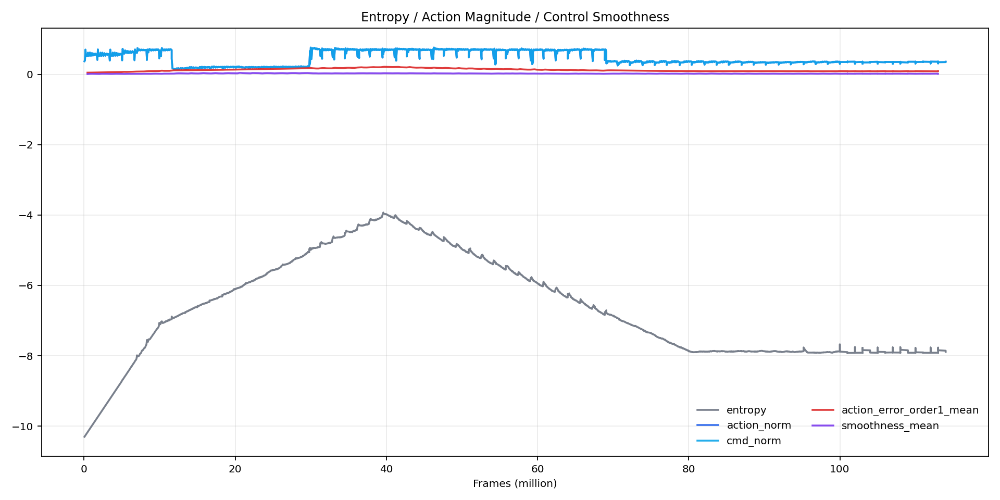

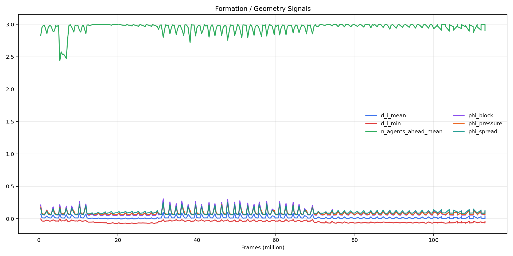

