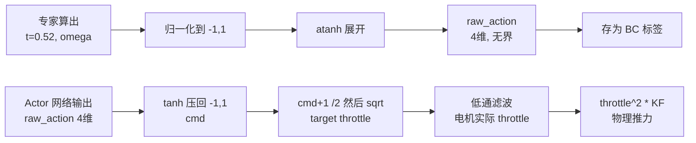
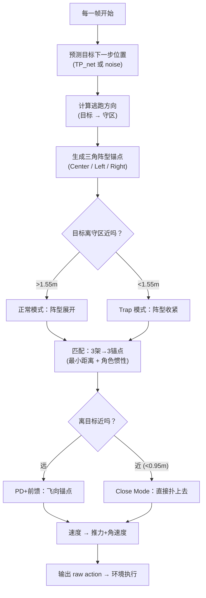

# 专家策略通俗解读

## 一句话概括

你的专家策略就是一个 **"预测 → 站位 → 收网"** 的手工控制器：先预测逃跑目标下一刻会跑到哪里，然后让 3 架无人机分别飞到目标前方和两侧形成三角包围阵型，最后在离目标足够近时一起收拢把它抓住。

---

## 1. 预测：目标下一步会去哪？

专家做的第一件事，是估计目标下一个时间步的位置。有两种模式：

| 模式 | 做法 |
|------|------|
| `noise` | 直接读取目标的真实下一帧位置，再叠加一点随机噪声来模拟"看不太准" |
| `tp_net` | 用一个训好的小型 LSTM 网络（`TP_net`），吃过去 10 帧的状态历史，输出对目标未来位置的预测 |

> [!NOTE]
> 正式采集专家数据时用的是 `tp_net` 模式——也就是说专家并不直接作弊读取未来位置，而是依赖一个神经网络来猜。

---

## 2. 站位：三角阵型怎么摆？

这是整个专家策略最核心的部分。三架无人机不是各自乱飞，而是被分配到一个 **三角形阵型** 的三个锚点上。

### 2.1 阵型的朝向

专家先算一个"前方"到底是哪个方向。这个方向是两件事的混合：
- **70%** 权重：从目标指向守区（goal zone）的方向 —— "目标最想去的方向"
- **30%** 权重：目标当前的运动方向 —— "目标实际正在走的方向"

这样得到的"前方"既考虑了目标的战略意图，又考虑了它的实时动态。

### 2.2 三个锚点位置

```
                    ● Center（正面拦截者）
                   /
    目标 ●--------/----------→ 守区方向
                 / \
                /   \
     ● Left   ·     · Right
   （左侧包抄）       （右侧包抄）
```

- **Center（中心锚点）**：在目标预测位置的正前方，距离大约 0.5~1.0 米。职责是"堵路"。
- **Left / Right（两翼锚点）**：在目标预测位置的略后方两侧，各偏开约 0.6 米。职责是"包夹"。

### 2.3 阵型会自动切换模式

当目标离守区还远时（> 1.55m），阵型处于 **正常模式**：
- Center 站得远一些（最多 1.0m 前方），主要负责远距离拦截
- Left/Right 展得更开（0.64m 侧偏），覆盖更宽的面

当目标离守区很近时（< 1.55m），阵型自动切到 **Trap 模式**（陷阱模式）：
- Center 收到只有 0.62m 前方
- Left/Right 也收紧到只有 0.34m 侧偏
- 整个阵型变得更小更紧密 —— 像一张正在收紧的网

> [!IMPORTANT]
> 如果目标已经非常逼近守区（< 1.10m），阵型会进入 **紧急模式**，三角形进一步收缩到极限。

---

## 3. 谁飞去哪？—— 锚点匹配

3 架无人机、3 个锚点位置，怎么分配？

专家用 **匈牙利式穷举匹配**（3!=6 种排列全部试一遍），选总飞行距离最短的那种分配方案。

但这里有一个关键细节：**角色惯性**。

每次重新分配时，如果某架无人机需要换一个不一样的锚点，会额外增加 0.20 的惩罚成本。这使得分配方案倾向于保持稳定 —— 上一帧你是"左侧包抄"，这一帧大概率还是"左侧包抄"。

> [!TIP]
> 这个 `switch_penalty` 设计非常关键。如果没有它，无人机会在每一帧都重新洗牌角色，导致大量时间浪费在互相切换路线上，实际追捕效率大打折扣。这也是后来 BC 训练时发现 feedforward actor 学不好的原因之一 —— 它没有"记忆"，容易每帧临时拍脑袋换角色。

---

## 4. 怎么飞过去？—— 速度指令

分配好锚点之后，每架无人机的速度指令通过一个 **PD 控制 + 前馈** 来计算：

```
期望速度 = Kp × (锚点位置 - 当前位置) + 0.85 × 目标速度前馈 - Kd × 当前速度
```

- `Kp × (锚点 - 当前位置)`：比例项，锚点越远飞得越快
- `0.85 × 目标速度前馈`：跟随目标的运动，保持相对位置
- `Kd × 当前速度`：阻尼项，避免超调抖振

其中 Center 锚点的 Kp 更大（1.90 vs 1.65），说明正面拦截者需要更激进地冲到位。

### 4.1 Close Mode（近距收拢）

当任意无人机离目标 < 0.95m，或者某架无人机离它的锚点 < 0.45m 时，进入 **close mode**。此时速度指令切换为：

```
期望速度 = 2.05 × (收拢点 - 当前位置) + 0.92 × 目标速度 + 少量向心力 - 阻尼
```

Center 的收拢点变成几乎就是目标预测位置本身（仅前偏 0.03m），Left/Right 则从各自的侧面方向挤压进来。

**通俗说：远的时候站位等它，近了以后直接扑上去。**

### 4.2 高度控制

Z 轴上有独立的高度控制逻辑：
- 期望高度 = 目标预测高度 + 一点偏移（0.05~0.10m）
- 用 PD 控制跟随，限制在 1.2m ~ 4.6m 之间
- 保证无人机不会飞太低摔地上，也不会飞出边界

---

## 5. 速度 → 推力/角速度 → raw action（atanh 详解）

上面算出的 **期望速度向量** 还要转成四旋翼真正能执行的控制量。这个过程分两大步：先把速度变成物理控制量 `(t, omega)`，再把物理控制量编码成 RL actor 能输出的 raw action。

### 5.1 第一步：速度 → 推力 t 和角速度 omega

```
速度误差 = 期望速度 - 当前速度
期望加速度 = 3.2 * 速度误差   (P控制，水平限幅4.2, 垂直限幅3.5)
期望推力方向 = 期望加速度 + 重力   (飞机z轴该指哪)
推力大小 t = 0.52 * (总推力 / 9.81)  (0.52是悬停推力比)
角速度 omega = 2.7 * 姿态误差 → 转到机体系 → 限幅
```

到这里我们得到了两个物理量：
- **t**：归一化推力标量，在 [0, 0.9]（0 = 不推，0.52 = 悬停，0.9 = 最大推力）
- **omega**：机体系角速度 [wx, wy, wz]，单位 rad/s，限幅在 +/-2.51 rad/s 内

### 5.2 第二步：(t, omega) → raw action（atanh 映射）

这一步的关键在于：**RL actor 网络输出的是 (-inf, +inf) 的无界数值**，环境端再用 `tanh` 把它压回 [-1, 1]，然后再转成电机命令。所以专家要想产生和 actor 一样格式的标签，就需要做 **tanh 的反函数 = atanh**。

具体代码在 `t_omega_to_pidrate_raw()` 里，分三步：

#### 步骤 A：角速度归一化到 [-1, 1]

```python
rate_norm = (omega / max_body_rate_rad_s).clamp(-0.999, 0.999)
# 例如：omega = [1.0, -0.5, 0.2] rad/s, max = 2.51 rad/s
# rate_norm = [0.398, -0.199, 0.080]
```

就是把角速度除以最大允许角速度，变成 [-1, 1] 范围的比例值。

#### 步骤 B：推力映射到 [-1, 1]

```python
thrust_norm = (2.0 * t - 1.0).clamp(-0.999, 0.999)
# 例如：t = 0.52 (悬停)
# thrust_norm = 2 * 0.52 - 1 = 0.04
# 即：t=0 映射到 -1, t=0.5 映射到 0, t=1 映射到 +1
```

这是一个线性映射：推力从 [0, 1] 映射到 [-1, 1]。悬停时大约在 0 附近。

#### 步骤 C：atanh 展开到 (-inf, +inf)

```python
raw_action = atanh([rate_norm_x, rate_norm_y, rate_norm_z, thrust_norm])
# 承接上面的例子：
# atanh([0.398, -0.199, 0.080, 0.04])
# 约等于 [0.420, -0.202, 0.080, 0.040]
```

atanh 函数长这样：

```
输入 x:    -1 --------- 0 --------- +1
输出:      -inf  <<<  接近线性  >>>  +inf
```

**在接近 0 的地方，atanh(x) 约等于 x**，基本不变。但在靠近 +/-1 的时候，atanh 会急剧放大到 +/-inf。

> [!IMPORTANT]
> **为什么要做 atanh？**
>
> 因为 RL actor 的输出是一个高斯分布，采样值域是 (-inf, +inf)。环境收到这个无界的 raw action 后，会先过一个 `tanh` 压到 [-1, 1]，然后再转成电机命令。所以：
> - **actor 输出** raw_action 属于 (-inf, +inf)
> - **环境端** `cmd = tanh(raw_action)` 属于 (-1, 1)
> - **专家要倒推** raw_action = `atanh(cmd)` ，才能产生和 actor 同域的监督标签
>
> 如果专家直接存归一化后的 [-1, 1] 值当标签，那就和 actor 实际输出的空间不匹配了。

### 5.3 环境端怎么解码 raw action

环境收到 raw action 后的处理链路（在 `RotorGroup.forward()` 里）：

```
raw_action 属于 (-inf, +inf)
    | actor 输出时自带 tanh
    v
cmd 属于 (-1, +1)
    | target_throttle = sqrt((cmd + 1) / 2)
    v
target_throttle 属于 (0, 1)
    | 一阶低通滤波（电机惯性）
    v
throttle(t)
    | thrust = throttle^2 * KF
    v
实际推力 (N)
```

用悬停的例子走一遍：

```
raw_action[3] = 0.04   (专家算出来的推力 raw)
    | tanh(0.04) = 0.04       (接近 0，几乎不变)
cmd = 0.04
    | (0.04 + 1) / 2 = 0.52
    | sqrt(0.52) = 0.72
target_throttle = 0.72
    | 经过电机低通滤波
throttle = 0.72
    | 0.72^2 * KF = 0.52 * KF
推力 = 机体重力   <-- 正好悬停！
```

### 5.4 完整映射链路图



### 5.5 一句大白话

> atanh 就是一个"编码器"。专家算出来的推力和角速度是有物理边界的（推力 0~0.9，角速度 +/-2.51 rad/s），但 actor 网络输出是无边界的实数。atanh 就是把有界的物理量"解压"成无界的数，这样专家的标签才能和 actor 的输出在同一个空间里做比较。环境端再用 tanh 把它"压"回来。**两者是一对互逆操作：atanh 编码，tanh 解码。**

---

## 6. 整体流程图



---

## 7. 关键数字速查表

| 参数 | 值 | 含义 |
|------|-----|------|
| 追捕者速度上限 | 1.5 m/s | 和目标速度一样快 |
| 抓捕半径 | 0.4 m | 任一无人机离目标 < 0.4m 即判定捕获 |
| 竞技场半径 | 2.5 m | 圆柱形边界 |
| 守区中心 | (2.0, 0, 2.5) | 目标想逃去的地方 |
| Trap 模式触发距离 | 1.55 m | 目标离守区这么近就开始收网 |
| 角色切换惩罚 | 0.20 | 抑制锚点分配频繁切换 |
| 专家自身成功率 | ~66.3% | 不完美但足够好 |

---

## 8. 一句大白话总结

> 这个专家就是一个"三个人打篮球全场紧逼防守"的策略：一个人堵正面，两个人包两侧。对方往哪跑，阵型就跟着转。越是逼近篮筐（守区），防守越收紧。离得近了就不再站位了，直接扑上去抢球。
