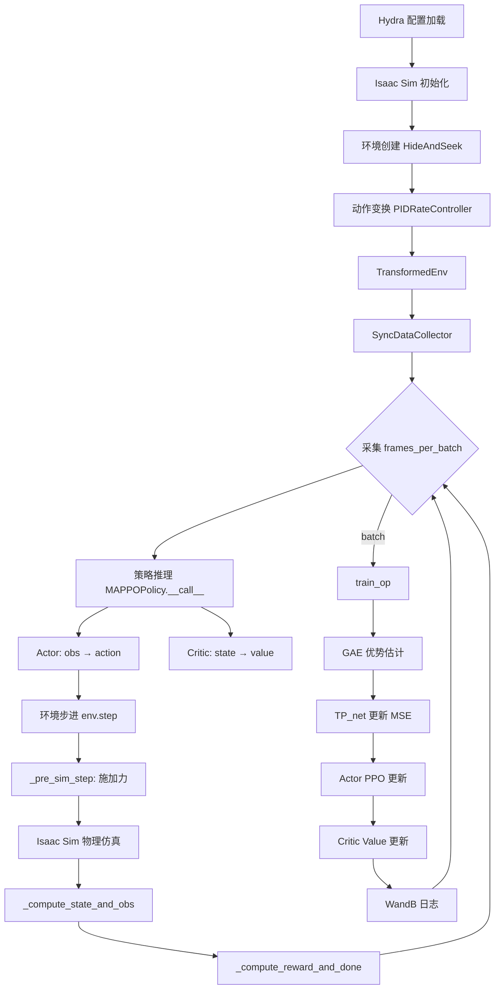

# Multi-UAV Pursuit-Evasion 项目结构详解

> **项目来源**: [thu-uav/Multi-UAV-pursuit-evasion](https://github.com/thu-uav/Multi-UAV-pursuit-evasion)  
> **论文**: *Learning to Pursue and Evade with Multiple UAVs in Cluttered Environments* (Tsinghua University)  
> **核心框架**: NVIDIA Isaac Sim 2022.2.0 + PyTorch + TorchRL + Hydra

---

## 目录

- [1. 项目概述](#1-项目概述)
- [2. 顶层目录结构](#2-顶层目录结构)
- [3. 核心包 `omni_drones/`](#3-核心包-omni_drones)
  - [3.1 包初始化 `__init__.py`](#31-包初始化-__init__py)
  - [3.2 环境模块 `envs/`](#32-环境模块-envs)
  - [3.3 学习算法模块 `learning/`](#33-学习算法模块-learning)
  - [3.4 机器人模块 `robots/`](#34-机器人模块-robots)
  - [3.5 执行器模块 `actuators/`](#35-执行器模块-actuators)
  - [3.6 控制器模块 `controllers/`](#36-控制器模块-controllers)
  - [3.7 传感器模块 `sensors/`](#37-传感器模块-sensors)
  - [3.8 视图与物理交互 `views/`](#38-视图与物理交互-views)
  - [3.9 工具函数 `utils/`](#39-工具函数-utils)
- [4. 配置系统 `cfg/`](#4-配置系统-cfg)
- [5. 训练与评估脚本 `scripts/`](#5-训练与评估脚本-scripts)
- [6. 第三方依赖 `third_party/`](#6-第三方依赖-third_party)
- [7. 环境配置 `conda_setup/`](#7-环境配置-conda_setup)
- [8. 数据流与训练流程](#8-数据流与训练流程)
- [9. 关键技术点](#9-关键技术点)

---

## 1. 项目概述

本项目实现了一个**多无人机协作追逃系统** (Multi-UAV Pursuit-Evasion)，使用强化学习算法（MAPPO）训练多架无人机在包含障碍物（圆柱体）的3D环境中协作追捕一个逃逸目标。

**核心特点**：
- 基于 **NVIDIA Isaac Sim** 物理仿真引擎进行高保真无人机动力学模拟
- 使用 **MAPPO** (Multi-Agent PPO) 算法进行多智能体协作训练
- 集成 **目标预测网络 (TP_net)** 用LSTM预测逃逸目标的未来位置
- 支持**课程学习 (Curriculum Learning)** 渐进式提升环境难度
- 支持**两阶段奖励微调 (Two-Stage Reward Refinement)** 的部署训练

---

## 2. 顶层目录结构

```
multi-uav-pursuit2/
├── cfg/                    # Hydra配置文件 (YAML)
│   ├── train.yaml          # 训练主配置
│   ├── algo/               # 算法配置 (mappo.yaml)
│   ├── task/               # 任务配置 (HideAndSeek.yaml等)
│   └── base/               # 基础配置 (env_base, sim_base)
│
├── omni_drones/            # 核心Python包
│   ├── __init__.py         # 包初始化, SimulationApp管理
│   ├── envs/               # 仿真环境定义
│   ├── learning/           # RL算法实现
│   ├── robots/             # 无人机模型定义
│   ├── actuators/          # 执行器 (电机组)
│   ├── controllers/        # 控制器 (PID, Lee等)
│   ├── sensors/            # 传感器 (相机)
│   ├── views/              # Isaac Sim视图封装
│   └── utils/              # 工具函数
│
├── scripts/                # 可执行脚本
│   ├── train.py            # 标准训练脚本
│   ├── train_generator.py  # 课程学习训练脚本
│   ├── train_deploy.py     # 部署训练脚本
│   └── eval.py             # 评估脚本
│
├── third_party/            # Git子模块
│   ├── tensordict/         # TensorDict数据结构库
│   └── torchrl/            # TorchRL强化学习库
│
├── conda_setup/            # Conda激活脚本
├── examples/               # 使用示例
├── docs/                   # 项目文档
├── setup.py                # Python包安装配置
├── project_log.md          # 项目操作日志
└── README.md               # 项目说明
```

---

## 3. 核心包 `omni_drones/`

### 3.1 包初始化 `__init__.py`

| 功能 | 说明 |
|------|------|
| `CONFIG_PATH` | 全局配置路径常量，指向 `cfg/` 目录 |
| `init_simulation_app(cfg)` | 初始化 Isaac Sim 应用，设置渲染、物理模拟等参数 |
| `TensorDict.shapes` | 为 TensorDict 扩展的属性，递归获取所有张量的 shape |
| `TensorDict.devices` | 为 TensorDict 扩展的属性，递归获取所有张量的 device |

**关键逻辑**: 根据 `cfg.headless` 决定是否启用渲染；设置了 `physics_dt` 和 `rendering_dt`。

---

### 3.2 环境模块 `envs/`

这是项目最核心的部分，定义了仿真环境的全部逻辑。

```
envs/
├── __init__.py              # 导出 HideAndSeek, HideAndSeek_envgen, HideAndSeek_deploy, IsaacEnv
├── isaac_env.py             # 所有环境的抽象基类 (390行)
├── utils.py                 # 障碍物创建等工具函数
├── assets/                  # USD资源文件 (地面贴图等)
└── hide_and_seek/           # 追逃任务环境目录
    ├── __init__.py
    ├── hideandseek.py       # 标准追逃环境 (1284行)
    ├── hideandseek_envgen.py# 课程学习环境 (1612行)
    ├── hideandseek_deploy.py# 部署训练环境 (1272行)
    ├── placement.py         # 障碍物放置算法
    ├── draw.py              # 轨迹/检测范围绘制
    └── draw_circle.py       # 圆形场地绘制
```

#### 3.2.1 `IsaacEnv` — 基类 (`isaac_env.py`)

所有自定义环境的**抽象基类**，封装了 Isaac Sim 仿真的核心框架。

| 方法/属性 | 功能 |
|-----------|------|
| `_design_scene()` | **抽象方法**。设计仿真场景（放置无人机、目标、障碍物等） |
| `_set_specs()` | **抽象方法**。定义观测空间、动作空间、奖励空间的维度和类型 |
| `_reset_idx(env_ids)` | **抽象方法**。对指定环境重置所有物体的位姿、速度、状态 |
| `_pre_sim_step(tensordict)` | **抽象方法**。仿真步之前执行的操作（如施加力、设置速度） |
| `_compute_state_and_obs()` | **抽象方法**。从仿真中获取并计算观测和状态数据 |
| `_compute_reward_and_done()` | **抽象方法**。计算奖励值和episode结束标志 |
| `step(tensordict)` | 执行一个完整的仿真步：action → physics → obs/reward |
| `get_env_poses()` | 获取局部坐标系下的位姿（相对于环境原点） |

**并行环境机制**: 使用 Isaac Sim 的 `GridCloner` 将单个场景复制为多个并行环境（由 `num_envs` 控制），显著加速数据采集。

#### 3.2.2 `HideAndSeek` — 标准追逃环境 (`hideandseek.py`)

**核心环境实现**，定义了多无人机追逃任务的完整逻辑。

##### 场景元素

| 元素 | 数量 | 说明 |
|------|------|------|
| **追捕无人机 (Drone)** | `num_agents` (默认3架) | Crazyflie四旋翼，PID速率控制 |
| **逃逸目标 (Target)** | 1个 | DynamicSphere，基于力场的规则策略 |
| **圆柱障碍物 (Cylinder)** | 4-6个 | 高度等于场地最大高度，可遮挡视线 |
| **圆形场地 (Arena)** | 1个 | 半径`arena_size=0.9m`，高度`max_height=1.2m` |

##### 观测空间 (Observation)

每架无人机获得的**局部观测** `obs`（shape: `[num_envs, num_agents, ...]`）：

| 键 | 维度 | 内容 |
|----|------|------|
| `state_self` | `[1, obs_dim]` | 目标相对位置（被遮挡时masking）、TP预测位置、自身姿态+速度、时间编码 |
| `state_others` | `[num_agents-1, 3]` | 其他无人机的相对位置 |
| `cylinders` | `[obs_max_cylinder, 5]` | 最近K个障碍物的相对位置+高度+半径 |

**全局状态** `state`（用于Critic的集中式价值估计）：

| 键 | 维度 | 内容 |
|----|------|------|
| `state_drones` | `[num_agents, state_dim]` | 所有无人机的目标相对位置+姿态+速度 |
| `cylinders` | `[obs_max_cylinder, 5]` | 最近K个障碍物信息 |

##### 奖励函数

总奖励 = 以下各项之和：

| 奖励项 | 系数(默认) | 功能 |
|--------|-----------|------|
| `distance_reward` | `dist_reward_coef=1.0` | 距离惩罚（个体距离） |
| `detect_reward` | `detect_reward_coef=0.0` | 检测到目标的奖励 |
| `catch_reward` | `catch_reward_coef=60.0` | 捕获奖励（进入捕获半径且未被遮挡） |
| `collision_reward` | `collision_coef=100.0` | 碰撞惩罚（障碍物、无人机间、墙壁） |
| `speed_reward` | `speed_coef=10.0` | 超速惩罚 |
| `smoothness_reward` | `smoothness_coef=0.0` | 动作平滑度奖励 |

##### 逃逸目标策略 (`_get_dummy_policy_prey`)

基于**人工势场法** (Artificial Potential Field)，目标受三种力：
1. **追捕无人机排斥力**: 检测范围内且未被遮挡的无人机产生排斥力
2. **场地边界排斥力**: 接近圆形边界和高度上下限时产生排斥力
3. **障碍物排斥力**: 检测范围内所有障碍物产生排斥力

目标以固定速度 `v_prey` 沿合力方向运动。

##### 视线遮挡判定 (`is_line_blocked_by_cylinder`)

在XY平面上判断无人机与目标之间的连线是否被圆柱体遮挡：
1. 计算圆柱体圆心到连线的距离
2. 判断投影点是否在线段内部
3. 仅考虑地面上方的活跃障碍物

#### 3.2.3 `HideAndSeek_envgen` — 课程学习环境 (`hideandseek_envgen.py`)

在标准环境基础上增加了**自适应环境生成器**，核心是 `GenBuffer` 类。

##### `GenBuffer` 工作机制

| 功能 | 说明 |
|------|------|
| **初始化** | 生成简单任务（无人机和目标相邻）填充历史缓冲区 |
| **基于成功率的采样** | 根据捕获成功率决定从缓冲区采样 vs 随机生成 |
| **FPS (Farthest Point Sampling)** | 使用最远点采样维护缓冲区多样性，避免环境坍缩到简单任务 |
| **邻近扰动** | `samplenearby` 方法在已知任务附近生成稍难的变体 |
| **网格系统** | 将连续坐标离散化到网格，确保放置合法性（无重叠） |

**课程学习流程**:
1. 初始阶段使用简单任务（目标近、障碍物少）
2. 监控成功率 → 成功率高时 → 生成更难的环境变体
3. 持续通过FPS维护任务多样性，历史缓冲区大小上限 5000

#### 3.2.4 `HideAndSeek_deploy` — 部署训练环境 (`hideandseek_deploy.py`)

支持**两阶段奖励微调**的环境：
- `init_smoothness_coef` / `max_smoothness_coef` / `smooth_lr`: 动态调整平滑度惩罚系数
- `use_deployment` 标志：切换训练/部署模式
- 额外跟踪 `prev_action` 实现动作平滑度约束
- 逐步增加平滑度惩罚系数，微调已训练策略使其产生更平滑的控制指令

---

### 3.3 学习算法模块 `learning/`

```
learning/
├── __init__.py          # 导出 MAPPOPolicy, PPOPolicy, TP_net等
├── mappo.py             # MAPPO算法+TP_net (662行)
├── _ppo.py              # 基础PPO实现
├── common.py            # MyBuffer, make_encoder, soft_update (149行)
├── modules/             # 神经网络模块
│   ├── networks.py      # MLP, Attention编码器 (ENCODERS_MAP)
│   ├── distributions.py # DiagGaussian, TanhNormal等分布模块
│   └── rnn.py           # GRU循环网络
├── ppo/                 # PPO变体
│   ├── ppo_adaptive.py  # 自适应PPO
│   └── ppo_rnn.py       # 带RNN的PPO
└── utils/
    ├── gae.py           # GAE (Generalized Advantage Estimation)
    └── valuenorm.py     # ValueNorm (价值归一化)
```

#### 3.3.1 `MAPPOPolicy` (`mappo.py`)

**核心强化学习策略类**，实现了完整的 MAPPO 训练管线。

##### 架构组件

| 组件 | 说明 |
|------|------|
| **Actor (策略网络)** | `Encoder → (可选GRU) → ActionDistribution`<br/>输入观测 → 输出动作分布<br/>支持共享参数 (`share_actor=True`) 或独立参数 |
| **Critic (价值网络)** | `Encoder → (可选GRU) → V_out`<br/>集中式 (`critic_input=state`) 或 去中心化 (`critic_input=obs`) |
| **TP_net (目标预测网络)** | `LSTM → FC → tanh`<br/>输入历史帧状态 → 输出未来位置预测 |

##### 训练流程 (`train_op`)

```
1. 计算 GAE (Generalized Advantage Estimation)
   - rewards, dones → advantages, returns
   - 可选 ValueNorm 归一化

2. TP_net 更新 (if use_TP_net)
   - 使用 unfold 构建未来真值窗口
   - MSE损失监督训练

3. PPO Actor 更新 (ppo_epoch轮)
   - 重新计算 log_prob → 计算 ratio
   - Clipped surrogate loss + 熵正则化
   - 梯度裁剪 (max_grad_norm=10)

4. Critic 更新
   - Clipped value loss (MSE或Huber)
   - 可选学习率调度器
```

##### Encoder 架构 (`common.py: make_encoder`)

根据输入规格自动选择编码器：
- **简单张量输入**: `LayerNorm → MLP [256, 256, 256]`
- **复合输入 (CompositeSpec)**: `PartialAttentionEncoder` — 使用注意力机制处理不同维度的异构输入（自身状态、其他无人机、障碍物）

#### 3.3.2 `TP_net` — 目标预测网络

| 参数 | 说明 |
|------|------|
| 输入 | `[batch, history_step, feature_dim]` — 历史10帧的状态 |
| 网络 | `LSTM (hidden=64, 1层)` → `Linear` → `tanh` |
| 输出 | `[batch, future_step * 3]` — 未来5步的XYZ坐标 (归一化到[-1,1]) |
| 训练 | 与MAPPO联合训练，MSE损失，单独优化器 (lr=0.0001) |

---

### 3.4 机器人模块 `robots/`

```
robots/
├── __init__.py       # 导出 RobotBase, RobotCfg
├── robot.py          # 机器人抽象基类 (251行)
├── config.py         # 物理属性配置 (RigidBodyPropertiesCfg等)
├── assets/           # USD模型文件 (各型号无人机3D模型)
│   ├── cf2x/         # Crazyflie 2.x
│   ├── firefly/      # Firefly
│   ├── hummingbird/  # Hummingbird
│   └── ...
├── assembly/         # 组装定义
└── drone/            # 无人机实现
    ├── __init__.py
    ├── multirotor.py # 多旋翼基类 (759行) ← 核心文件
    ├── cf2x.py       # Crazyflie 2.X
    ├── crazyflie.py  # Crazyflie
    ├── firefly.py    # Firefly
    ├── hummingbird.py# Hummingbird
    ├── iris.py       # Iris
    ├── neo11.py      # Neo11
    ├── omav.py       # OMAV (全向飞行器)
    └── dragon.py     # Dragon (变形飞行器)
```

#### 3.4.1 `RobotBase` (`robot.py`)

所有机器人的**抽象基类**，提供 Isaac Sim 物理对象的核心管理：

| 功能 | 说明 |
|------|------|
| `spawn(translations)` | 在仿真场景中创建USD prim，应用物理属性 |
| `initialize()` | 创建物理视图 (ArticulationView/RigidPrimView)，绑定物理后端 |
| `get/set_world_poses()` | 获取/设置刚体位姿 |
| `get/set_velocities()` | 获取/设置刚体速度 |
| `REGISTRY` | 类级别注册表，所有子类自动注册 |

#### 3.4.2 `MultirotorBase` (`multirotor.py`)

**多旋翼无人机基类** — 本项目最重要的机器人类。

##### 物理参数 (从YAML配置加载)

| 参数类别 | 属性 |
|----------|------|
| **刚体** | 质量 `mass`、惯性矩 `inertia_xx/yy/zz`、阻力系数 `drag_coef` |
| **转子** | 力常数 `KF`、力矩常数 `KM`、最大转速 `MAX_ROT_VEL`、时间常数 `tau_up/down` |
| **推力** | 推重比 `THRUST2WEIGHT`、力-力矩比 `FORCE2MOMENT` |

##### 状态向量 (19维 + 转子数)

```python
state = [pos(3), rot(4), vel(6), heading(3), up(3), throttle(num_rotors)]
# pos:      世界坐标位置
# rot:      四元数姿态
# vel:      线速度(3) + 角速度(3)
# heading:  机头方向(x轴)
# up:       向上方向(z轴)
# throttle: 各电机油门值 (normalized to [-1,1])
```

##### 力学模型 (`apply_action`)

```
输入动作 → RotorGroup (电机模型) → 推力/力矩
                    ↓
   旋翼力 → rotors_view.apply_forces
   合力矩 → base_link.apply_torques
   下洗效应 → downwash model (多机时)
   空气阻力 → drag_coef * mass * velocity
```

##### 域随机化 (`setup_randomization`)

支持训练/评估阶段独立配置的参数随机化：

| 可随机化参数 | 说明 |
|-------------|------|
| `mass_scale` | 质量缩放范围 |
| `inertia_scale` | 惯性矩缩放范围 |
| `t2w_scale` | 推重比缩放范围 |
| `f2m_scale` | 力-力矩比缩放范围 |
| `drag_coef_scale` | 阻力系数范围 |
| `rotor_offset_scale` | 电机位置偏移 |
| `tau_up/tau_down` | 电机响应时间常数 |

---

### 3.5 执行器模块 `actuators/`

```
actuators/
├── __init__.py
└── rotor_group.py    # 电机组模型 (72行)
```

#### `RotorGroup` (`rotor_group.py`)

模拟真实电机的**一阶延迟响应**：

```
Target Throttle = sqrt(clamp((cmd + 1) / 2, 0, 1))
τ = dt / time_constant                    # 响应速率
Throttle(t+dt) = Throttle(t) + τ * (Target - Throttle(t))
Thrust = Throttle² × KF
Moment = Throttle² × KM × direction
```

| 参数 | 默认值 | 说明 |
|------|--------|------|
| `time_constant` | 由YAML配置 | 电机一阶延迟时间常数 |
| `noise_scale` | 0.002 (当前×0=禁用) | 油门噪声幅度 |
| `KF` | `max_rot_vel² × force_constant` | 力常数 |
| `KM` | `max_rot_vel² × moment_constant` | 力矩常数 |

---

### 3.6 控制器模块 `controllers/`

```
controllers/
├── __init__.py                    # 导出所有控制器
├── lee_position_controller.py     # Lee位置控制器及变体
└── dsl_pid_controller.py          # DSL PID控制器
```

提供从高级指令到电机命令的**动作变换层**：

| 控制器 | 输入 | 输出 | 用途 |
|--------|------|------|------|
| `LeePositionController` | 目标位置/速度 | 电机推力指令 | 位置闭环控制 |
| `AttitudeController` | 目标姿态+推力 | 电机推力指令 | 姿态控制 |
| `RateController` | 角速率+推力 | 电机推力指令 | 角速率控制 |
| **`PIDRateController`** | 角速率+推力 | 电机推力指令 | **本项目默认** (`action_transform: PIDrate`) |
| `DSLPIDController` | 目标位姿 | 电机推力指令 | DSL实验室PID |

在 `train.py` 中，`action_transform` 配置决定使用哪个控制器。默认 `PIDrate` 表示：
- 策略网络输出4维动作（3轴角速率 + 总推力）
- `PIDRateController` 将其转换为4个电机的独立推力指令

---

### 3.7 传感器模块 `sensors/`

```
sensors/
├── __init__.py
├── camera.py     # 相机传感器 (8388 bytes)
└── config.py     # 传感器配置
```

提供视觉观测能力（本追逃任务中未主要使用，但框架支持）。

---

### 3.8 视图与物理交互 `views/`

```
views/
├── __init__.py
├── articulation_view.py   # 关节体视图封装 (17629 bytes)
├── rigid_prim_view.py     # 刚体视图封装 (8829 bytes)
└── utils.py               # 工具函数
```

对 Isaac Sim 的 `ArticulationView` 和 `RigidPrimView` 进行封装，提供：
- **批量操作**: 同时获取/设置多个环境中所有物体的状态
- **Shape对齐**: 自动将扁平视图数据 reshape 为 `[num_envs, num_objects, ...]` 格式
- **力/力矩施加**: 对旋翼、机身施加力和力矩

---

### 3.9 工具函数 `utils/`

```
utils/
├── __init__.py
├── torch.py          # PyTorch工具: 四元数运算, cpos, off_diag, quat_rotate等
├── math.py           # 数学工具: 旋转矩阵等
├── kit.py            # Isaac Sim工具: 物理属性设置, 地面创建等 (26120 bytes)
├── scene.py          # 场景设计工具 (10343 bytes)
├── wandb.py          # WandB实验跟踪初始化
├── bspline.py        # B样条曲线生成 (轨迹规划)
├── poisson_disk.py   # 泊松盘采样 (障碍物多样性放置)
├── image.py          # 图像处理工具
├── set_transforms.py # 变换设置工具
├── envs/             # 环境工具 (日志transforms等)
└── torchrl/          # TorchRL扩展
    ├── env.py        # AgentSpec定义
    ├── collector.py  # SyncDataCollector
    └── transforms.py # 动作变换 (VelController, RateController等)
```

#### 关键工具函数 `torch.py`

| 函数 | 功能 |
|------|------|
| `cpos(x, y)` | 计算两组位置间的相对位置矩阵 |
| `off_diag(x)` | 提取矩阵的非对角线元素（用于排除自身） |
| `quat_rotate(q, v)` | 用四元数旋转向量 |
| `quat_rotate_inverse(q, v)` | 四元数逆旋转（世界→机体） |
| `quat_axis(q, axis)` | 获取四元数定义的坐标轴方向 |
| `normalize(x)` | 向量归一化 |
| `others(x)` | 提取"其他智能体"的数据 |
| `euler_to_quaternion(rpy)` | 欧拉角→四元数 |
| `symlog(x)` | 对称对数变换 |

---

## 4. 配置系统 `cfg/`

使用 **Hydra** 框架管理所有超参数，支持组合式配置和命令行覆盖。

```
cfg/
├── train.yaml          # 训练主配置
├── algo/
│   └── mappo.yaml      # MAPPO超参数
├── task/
│   ├── HideAndSeek.yaml        # 标准任务
│   ├── HideAndSeek_envgen.yaml # 课程学习任务
│   └── HideAndSeek_deploy.yaml # 部署训练任务
└── base/
    ├── env_base.yaml   # 环境基础参数
    └── sim_base.yaml   # 仿真基础参数
```

### 4.1 `train.yaml` — 训练主配置

| 参数 | 默认值 | 说明 |
|------|--------|------|
| `headless` | `true` | 无头模式（不渲染画面） |
| `total_frames` | `30,000,000,000` | 总训练帧数 |
| `save_interval` | `100` | 每100次迭代保存一次模型 |
| `eval_interval` | `-1` | 评估间隔 (-1=不评估) |
| `seed` | `0` | 随机种子 |
| `wandb.mode` | `disabled` | WandB模式 (disabled/online) |
| `defaults.task` | `HideAndSeek` | 默认任务 |
| `defaults.algo` | `mappo` | 默认算法 |

### 4.2 `mappo.yaml` — 算法超参数

| 参数 | 默认值 | 说明 |
|------|--------|------|
| `train_every` | `64` | 每采集64步训练一次 |
| `num_minibatches` | `16` | 小批量数 |
| `ppo_epochs` | `4` | PPO更新轮数 |
| `TP_epochs` | `1` | TP网络更新轮数 |
| `clip_param` | `0.1` | PPO裁剪范围 |
| `gamma` | `0.995` | 折扣因子 |
| `gae_lambda` | `0.95` | GAE λ |
| `share_actor` | `True` | 所有智能体共享策略网络 |
| `critic_input` | `obs` | Critic输入类型 (obs/state) |
| `actor.hidden_units` | `[256, 256, 256]` | Actor隐藏层 |
| `actor.attn_encoder` | `PartialAttentionEncoder` | 注意力编码器 |
| `critic.value_norm` | `ValueNorm1 (β=0.995)` | 价值归一化 |

### 4.3 `HideAndSeek.yaml` — 任务参数

| 参数 | 默认值 | 说明 |
|------|--------|------|
| `num_envs` | `100` | 并行环境数 |
| `max_episode_length` | `800` | 最大回合步数 |
| `drone_model` | `Crazyflie` | 无人机型号 |
| `num_agents` | `3` | 追捕无人机数量 |
| `arena_size` | `0.9` | 圆形场地半径 (m) |
| `max_height` | `1.2` | 场地最大高度 (m) |
| `v_drone` | `1.0` | 无人机最大速度限制 |
| `v_prey` | `1.3` | 目标速度 (乘以v_drone) |
| `catch_radius` | `0.3` | 捕获半径 (m) |
| `history_step` | `10` | TP网络历史帧数 |
| `future_predcition_step` | `5` | TP网络预测未来步数 |
| `scenario_flag` | `wall` | 场景类型 (empty/wall/narrow_gap/random/passage) |

---

## 5. 训练与评估脚本 `scripts/`

### 5.1 `train.py` — 标准训练脚本 (328行)

**训练主循环**，将所有组件串联：

```python
# 伪代码简化
cfg = hydra.main(config_name="train")
simulation_app = init_simulation_app(cfg)
env = TransformedEnv(HideAndSeek(cfg), [InitTracker, PIDRateController])
policy = MAPPOPolicy(cfg.algo, agent_spec, TP_net=env.TP)

collector = SyncDataCollector(env, policy, frames_per_batch)
for batch in collector:
    # 1. 收集统计信息
    episode_stats(batch)
    # 2. 策略更新
    info = policy.train_op(batch)
    # 3. 定期评估和保存
    if save_interval: torch.save(policy.state_dict(), ckpt_path)
    # 4. WandB日志
    wandb.log(info)
```

**关键步骤**:
1. **环境创建**: 根据配置实例化环境 + 控制器变换
2. **策略创建**: 实例化 MAPPO + TP_net
3. **数据收集**: `SyncDataCollector` 同步采集固定帧数
4. **策略优化**: `policy.train_op()` 执行 GAE → PPO → Critic 更新
5. **日志记录**: 统计信息 (成功率、碰撞率等) 通过 WandB 记录

### 5.2 `train_generator.py` — 课程学习训练

使用 `HideAndSeek_envgen` 环境，额外逻辑：
- 管理 `GenBuffer` 的历史任务缓冲区
- 根据成功率动态调整环境难度
- 定期保存生成的任务分布

### 5.3 `train_deploy.py` — 部署训练

使用 `HideAndSeek_deploy` 环境，特点：
- 加载预训练模型
- 逐步增加平滑度惩罚系数
- 微调策略以输出对真实飞行器更友好的平滑控制指令

### 5.4 `eval.py` — 评估脚本

加载检查点 → 在固定场景下运行 → 录制视频 → 输出统计指标

---

## 6. 第三方依赖 `third_party/`

| 库 | 版本 | 用途 |
|----|------|------|
| `tensordict` | Git子模块 | 高效的嵌套张量字典数据结构 |
| `torchrl` | Git子模块 | 强化学习环境接口、数据采集器、环境变换 |

两者均需从子模块安装：
```bash
cd third_party/tensordict && pip install -e .
cd third_party/torchrl && pip install -e .
```

---

## 7. 环境配置 `conda_setup/`

```
conda_setup/
└── etc/conda/
    ├── activate.d/env_vars.sh    # Conda激活时执行
    └── deactivate.d/env_vars.sh  # Conda去激活时执行
```

**`activate.d/env_vars.sh`** 功能：
1. 设置 `ISAACSIM_PATH` 环境变量
2. 调用 `setup_conda_env.sh` 配置 Isaac Sim Python路径
3. SSH连接时自动设置 `DISPLAY=:10.0` (X11转发)

---

## 8. 数据流与训练流程



**每一步的详细流程**:

1. **策略推理**: `MAPPOPolicy.__call__` 
   - Actor: 输入 obs → 输出动作分布 → 采样动作 → 计算 log_prob
   - Critic: 输入 state → 输出状态值估计
   
2. **动作变换**: `PIDRateController.forward`
   - 策略输出 [3轴角速率 + 推力] → PID控制器 → [4个电机推力]

3. **环境步进**: `IsaacEnv.step`
   - `_pre_sim_step`: 施加电机力/力矩 + 设置目标速度
   - `sim.step`: Isaac Sim 物理引擎执行一步
   - `_compute_state_and_obs`: 读取物理状态 → 计算观测
   - `_compute_reward_and_done`: 计算奖励 + 判断终止

4. **策略更新**: `MAPPOPolicy.train_op`
   - GAE: 计算广义优势估计
   - TP_net: LSTM目标预测网络单独更新
   - Actor: PPO clip loss + 熵正则化
   - Critic: Clipped value loss

---

## 9. 关键技术点

### 9.1 共享策略 (Parameter Sharing)

`share_actor=True` 时，所有无人机共享同一个Actor网络参数。这利用了追捕任务的**对称性**——每架无人机面对的决策问题在结构上相同。

### 9.2 部分可观测 (Partial Observability)

当 `use_partial_obs=1` 时：
- 目标位置被障碍物遮挡时，观测值被替换为 `mask_value=-5`
- 检测到目标后，信息**广播**给所有无人机 (`broadcast_detect`)
- TP_net 基于历史帧预测被遮挡目标的位置

### 9.3 注意力编码器 (PartialAttentionEncoder)

处理异构观测的关键组件：
- `state_self` (自身状态): 直接编码
- `state_others` (其他无人机): 排列不变的注意力聚合
- `cylinders` (障碍物): 排列不变的注意力聚合
- 最终拼接后输出固定维度的特征向量

### 9.4 下洗效应 (Downwash)

多机近距离飞行时，上方无人机的气流对下方无人机产生干扰力。模型采用简化的高斯衰减：

```python
v = exp(-0.5 * (kr * r / z)²) / (1 + kz * z)²
force = v * (-thrust_above)
```

### 9.5 逃逸目标自适应速度

当追捕成功率超过 98% 时，目标速度自动增加：
```python
if success_rate >= 0.98:
    v_prey += 0.05  # 逐步增加到最大 1.3
```

---

> **最后更新**: 2024年  
> **维护者**: daya-wq
