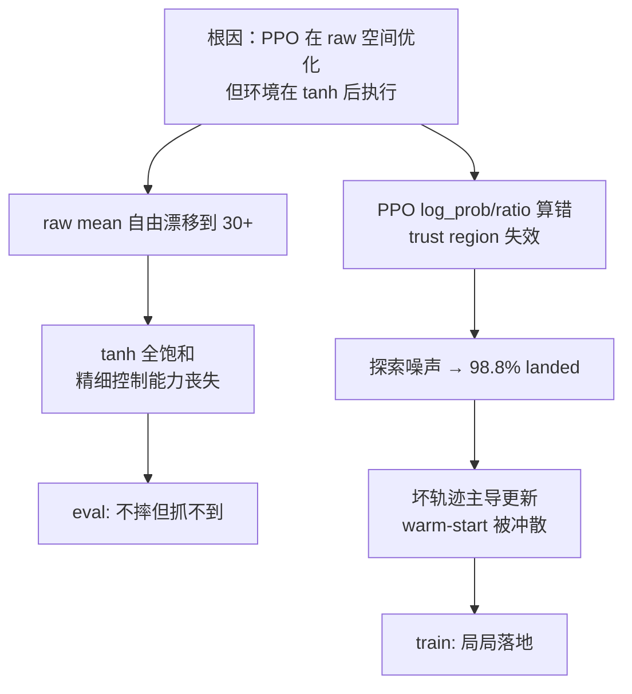

# RL Warm-Start 失败根因分析与修复建议

## 回答你的 5 个核心问题

### Q1：当前 PPO + raw Gaussian + 环境内再 tanh 的动作管线，是否本身就容易让 warm-start actor 学坏？

**是的，这是结构性问题，不是调参能解决的。**

我追完了完整的动作链路，问题非常清晰：

```
Actor 输出: raw_action ∈ (-inf, +inf)    ← PPO 在这个空间里算 log_prob / entropy / ratio
    |
    | PIDRateController._inv_call() 里做 torch.tanh(action)
    v
cmd ∈ (-1, +1)                           ← 环境真正执行的是这个
    |
    | (cmd+1)/2 → target_thrust, cmd*180*clip → target_rate
    v
电机
```

关键矛盾在于：

| | PPO 看到的 | 环境执行的 |
|--|-----------|-----------|
| 空间 | raw_action ∈ (-inf, +inf) | tanh(raw_action) ∈ (-1, 1) |
| log_prob | 基于 raw Gaussian | 不知道有 tanh |
| entropy | 基于 raw Gaussian 的 log_std | 不知道有 tanh |
| 梯度信号 | PPO ratio 在 raw 空间 | 但 reward 是 tanh 后的行为产生的 |

这意味着：

1. **PPO 的 log_prob 不是真实策略的 log_prob。** 真实执行的策略是 `tanh(N(mu, sigma))`，但 PPO 算的 log_prob 是 `N(mu, sigma)` 的。这两者差了一个 Jacobian 修正项 `log(1 - tanh(x)^2)`。ratio 算错了，PPO 的 trust region 就形同虚设。

2. **raw mean 可以无成本地往无穷大漂。** 当 raw_mean 从 0.5 漂到 30 时，tanh(0.5)=0.46 vs tanh(30)=1.0，环境执行的动作只变了一点点，但 PPO 在 raw 空间里看到的 mean 变化巨大。这个"免费漂移"不会立刻产生负 reward（因为 tanh 饱和了），但会让学习信号越来越模糊。

3. **entropy 被高估。** log_std=0.02 在 raw 空间里看起来熵不大，但 actor mean 已经在 30+ 的位置了，`tanh(30 + 0.02*noise)` 和 `tanh(30)` 几乎没区别。真实的行为熵接近 0，但 PPO 以为还有探索性。

**这就是你看到 `action_norm` 从 2.38 涨到 31.36 的根本原因——PPO 在 raw 空间里"自由膨胀"，环境端早就饱和了，但 PPO 的更新机制感知不到这个饱和。**

---

### Q2：为什么 51.6% 的 DAgger actor，一接 PPO 就被冲到 eval success = 0？

有三层原因叠加：

**第一层：探索噪声把 warm-start 飞行拖进坏状态。**

DAgger actor 是 deterministic 评测时 51.6%。但 PPO 训练需要 stochastic rollout，高斯噪声叠加上去后，无人机的行为会偏离 expert trajectory。对于这种高度非线性的四旋翼控制任务，哪怕偏一点点就可能进入 landed 状态——而你的数据也证实了：train `any_landed = 0.988`。

**第二层：坏轨迹的 reward 信号压倒好轨迹。**

PPO 用当前策略的 on-policy 轨迹来更新。当 98.8% 的训练轨迹都是 landed 的坏轨迹时，actor 收到的梯度信号几乎全部来自"怎么避免 landed 的惩罚"，而不是"怎么抓到目标的奖励"。这会快速把 actor 从 expert-like 行为拉向一个保守但无用的局部解。

**第三层：动作参数化的自由膨胀让问题不可逆。**

一旦 raw mean 开始漂移（因为 Q1 中分析的原因），即使后续 reward 信号变好，actor 也很难回到正常的 raw 值域了。因为在饱和区附近，梯度几乎为零——tanh 的导数在 ±30 处是 `1 - tanh(30)^2 ≈ 0`。

**这三层叠加就是：探索噪声 → 坏轨迹主导 → raw 空间漂移 → 不可逆退化。**

---

### Q3：train 几乎局局落地，但 eval 不全摔，这种 gap 的主因是什么？

**主因是 stochastic vs deterministic 的行为差异，被动作参数化放大了。**

- **训练时（stochastic）：** actor 从高斯采样，raw_action = mean + std * noise。当 mean 已经漂到 30+ 时，噪声在 raw 空间看似很小（std ≈ exp(0.02) ≈ 1.02），但采样结果依然在 30 附近，tanh 全饱和。偶尔 noise 把某个维度拉到负方向，就产生剧烈的推力/角速度突变 → landed。

- **评测时（deterministic）：** 直接取 mean，没有噪声。tanh(30) = 1.0，稳定地输出满推力/满角速度。这不会直接 landed，但也不会精细地追踪和抓捕——它变成了一个"稳定但呆板"的控制器。

所以 eval 不全摔，但抓不到（success = 0）。这不是 RNN hidden state 不一致的问题，而是**动作饱和 + 精细控制能力丧失**的直接后果。

---

### Q4：action_norm 持续上升到 31+ 意味着什么？应该怎么更正确地监控？

从代码来看（[mappo.py L876-882](file:///data/uavlab/multi-uav-pursuit2/omni_drones/learning/mappo.py#L876-L882)）：

```python
train_info["action_norm"] = raw_action.norm(dim=-1).mean().item()
train_info["cmd_norm"] = cmd_action.norm(dim=-1).mean().item()
```

但 `cmd_action` 这里实际上也是存的 squash 前的值（看 `tensordict[self.act_name]`），最终被 `PIDRateController._inv_call` 里的 `tanh` 处理之前就已经写回了。所以 `action_norm` 和 `cmd_norm` 几乎相同，反映的都是 raw 空间的数值。

**`action_norm = 31` 意味着 4 维 raw action 的 L2 范数是 31，平均每个维度约 15.5。tanh(15.5) = 1.0000...，完全饱和。**

建议新增的监控指标：

```python
# 直接加在 train_op 里，raw_action 已经有了
cmd_squashed = torch.tanh(raw_action)
train_info["post_tanh_saturation_frac"] = (cmd_squashed.abs() > 0.98).float().mean().item()
train_info["post_tanh_cmd_norm"] = cmd_squashed.norm(dim=-1).mean().item()
train_info["raw_action_mean_abs"] = raw_action.abs().mean().item()

# 分维度看推力 vs 角速度
train_info["raw_thrust_mean"] = raw_action[..., 3].abs().mean().item()
train_info["raw_rate_mean"] = raw_action[..., :3].abs().mean().item()
```

---

### Q5：如果只允许最小修改，应该优先改什么？

> [!IMPORTANT]
> **我的优先级排序：1 > 2 > 3 > 4，其中 1 和 2 应该一起做。**

#### 优先级 1：消除 double-tanh，统一动作参数化（改动最小但收益最大）

你现在的配置是 `algo.actor.tanh: false`（[mappo.yaml L47](file:///data/uavlab/multi-uav-pursuit2/cfg/algo/mappo.yaml#L47)），意味着 actor 用的是 `DiagGaussian`（raw Gaussian，无 squash）。

但环境端 `PIDRateController._inv_call` 又硬做了一次 `torch.tanh(action)`（[transforms.py L431](file:///data/uavlab/multi-uav-pursuit2/omni_drones/utils/torchrl/transforms.py#L431)）。

**有两种修法，选一种：**

**方案 A（推荐）：把 actor 改成 TanhNormal，去掉环境端的 tanh。**

- 把 `algo.actor.tanh` 改成 `true`
- actor 就变成 `TanhIndependentNormalModule`，输出的分布自带 tanh squash
- 此时 `log_prob` 会自动包含 Jacobian 修正
- 然后把 `PIDRateController._inv_call` 里的 `action = torch.tanh(action)` 删掉（因为 actor 已经帮你 squash 完了）
- 这样 PPO 的 log_prob / entropy / ratio 全部和真实执行动作一致

**方案 B：保持 raw Gaussian，但在 PPO update 里加 Jacobian 修正。**

- 手动在 `update_actor` 里把 log_prob 从 raw 空间修正到 squashed 空间
- 公式：`log_prob_corrected = log_prob_raw - sum(log(1 - tanh(raw_action)^2))`
- 这个改动更小但更容易出 bug

**我推荐方案 A。** 但注意：换成 TanhNormal 后，DAgger checkpoint 的权重需要确认兼容性——`TanhIndependentNormalModule` 和 `DiagGaussian` 的线性层结构相同（都是 `fc_mean` + `log_std`），但类名不同，需要在 warm-start 载入时做适配。

#### 优先级 2：warm-start 前期保护已有能力

改完动作参数化后，还需要在 PPO 前期保护 warm-start actor 不被冲散。几个可以一起用的手段：

| 手段 | 改动位置 | 说明 |
|------|---------|------|
| **极低初始 log_std** | `mappo.yaml log_std_init` 或载入后强制设置 | 载入后把 `log_std` 强制改为 `-3.0` 或更低，减少初期探索噪声 |
| **log_std 上限收紧** | `mappo.yaml log_std_max` | 当前是 `0.5`，那轮用了 `0.2` 还是太大。建议初期用 `-1.0` |
| **imitation anchor loss** | `mappo.py update_actor` | 在 PPO loss 上加一个 `bc_anchor = MSE(current_action, warmstart_action)` 项，前 N 步权重高，然后 anneal 掉 |
| **cold-start LR warmup** | `train.py` | 前 1000 万步用 1e-5 级别的 LR，然后再升到正常值 |

其中 **极低初始 log_std** 是最小改动、最直接有效的，因为它直接压制了训练初期探索噪声导致 landed 的问题。

#### 优先级 3：RNN hidden state 一致性

你用的是 GRU actor。需要确认：
- PPO rollout 时的 hidden state 是否在 episode 边界正确 reset
- PPO update 时的 minibatch 序列切分是否和 rollout 一致
- 这个在当前可能不是主因（因为 eval 不全摔说明 deterministic + RNN 本身还能用），但修好了动作参数化后可能会暴露这个问题

#### 优先级 4：reward 调整

你现在的 reward 不是主要问题，但有一个可以改进的点：对于 warm-start 这种"已经有一定能力"的 actor，`landed_penalty` 可以适当调大。当前 PPO 可能觉得 landed 的惩罚不够大，于是容忍了高 landed 率。

---

## 总结：根因 + 最小修改路线图



**最小修改路线：**

1. 把 `algo.actor.tanh` 改成 `true`，同时去掉 `PIDRateController._inv_call` 里的 `torch.tanh(action)`
2. warm-start 载入后，强制把 `log_std` 初始化到 `-3.0`，`log_std_max` 设为 `-1.0`
3. 加新的监控指标（post-tanh saturation、分维度 raw 统计）
4. 用 1e-5 的 LR 跑前 1000 万步，然后再升到 1e-4
