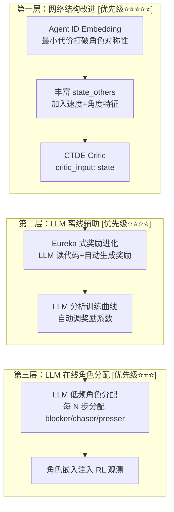

# 多无人机追捕协同问题：深度诊断与可行方案

## 一、问题深度诊断

### 1.1 当前系统架构总结

| 组件 | 当前实现 | 文件 |
|------|---------|------|
| 算法 | MAPPO (Multi-Agent PPO) | [mappo.py](file:///data/uavlab/multi-uav-pursuit2/omni_drones/learning/mappo.py) |
| Actor | **共享参数** (`share_actor: True`) | [mappo.yaml](file:///data/uavlab/multi-uav-pursuit2/cfg/algo/mappo.yaml) |
| Critic | 基于 obs 的分布式 critic (`critic_input: obs`) | 同上 |
| 编码器 | `PartialAttentionEncoder` (单层 attention) | [networks.py](file:///data/uavlab/multi-uav-pursuit2/omni_drones/learning/modules/networks.py#L250-L313) |
| 观测空间 | `state_self`(35D) + `state_others`(N-1, **仅3D位置**) + `cylinders`(K,5) | [hideandseek.py](file:///data/uavlab/multi-uav-pursuit2/omni_drones/envs/hide_and_seek/hideandseek.py#L421-L440) |
| 轨迹预测 | TP_net (LSTM, hidden=64) 预测目标未来5步位置 | [mappo.py](file:///data/uavlab/multi-uav-pursuit2/omni_drones/learning/mappo.py#L684-L701) |
| 场景 | `goal_defense`：3架追捕 vs 1目标，目标往 goal 区域跑 | [HideAndSeek.yaml](file:///data/uavlab/multi-uav-pursuit2/cfg/task/HideAndSeek.yaml) |
| 成功率 | **~16%，长期停滞** | 训练日志 |

### 1.2 根因分析：为什么协同学不出来

经过深度代码审计和文献调研，我认为问题的根源**不只在奖励**，而是多层面的系统性问题：

---

#### 根因 ① — 共享 Actor 下的角色坍缩 (Role Collapse)

> [!CAUTION]
> **这是最核心的瓶颈。**

当前 `share_actor=True`，所有 3 架无人机使用 **完全相同的** Actor 网络和权重。这意味着：

- 给定相同的 observation，所有 agent 会输出**完全相同的动作**
- 唯一的区分信号是 `state_others`（其他 agent 的相对位置，仅 3D），但这只是一个非常弱的 "谁在哪" 的信号
- **网络没有任何机制来决定 "我应该扮演堵截者还是追击者"**

这就是文献中所说的 **"parameter sharing 下的 homogeneous behavior 问题"**：

```
论文 [NeurIPS 2021, SNP]: "Naive parameter sharing leads agents to behave 
identically, preventing role specialization needed for coordinated tasks."

论文 [ICML 2020, ROMA]: "Without explicit role mechanisms, shared-parameter 
agents collapse to homogeneous policies, failing on tasks requiring 
division of labor."
```

**现象验证**：在你的 eval 视频中，是否看到 3 架无人机都倾向于朝目标直线飞去，而不是有分工地包围？如果是，这就是 role collapse 的典型表现。

---

#### 根因 ② — 观测空间缺少协调信息

当前 `state_others` 只有 **3D 相对位置**：

```python
# hideandseek.py, line ~1076
obs["state_others"] = self.drone_rpos  # [num_envs, N, N-1, 3] 只有位置！
```

这意味着**每个 agent 看不到队友在干什么**（速度、朝向），也看不到团队的整体态势（包围角度分布、缺口方向）。协同的前提是"知道队友的意图"，但当前观测完全不支持这一点。

| 缺失信息 | 对协同的影响 |
|---------|------------|
| 队友速度/朝向 | 无法推断队友的移动意图，无法预测谁会去哪 |
| 自己相对目标的角度 | 无法判断自己在包围圈中的位置 |
| 整体包围质量（角度均匀度） | 无法感知"哪个方向有缺口" |
| 目标逃跑方向与自己的相对位置 | 无法判断"我是否在拦截路径上" |

---

#### 根因 ③ — 协同奖励被关闭

```yaml
# HideAndSeek.yaml
distance_predicted_coef: 0.0   # 基于预测位置的距离奖励 = 关闭
encircle_coef: 0.0             # 包围奖励 = 关闭
```

你已经实现了 `encircle_reward`（角度均匀覆盖）和 `intercept_reward`（拦截奖励），但它们的系数为 0。**网络没有任何梯度信号来学习"包围比直追更好"**。

但这并不是简单地把它们打开就能解决的——因为根因①和②存在，网络本身就没有能力表达"不同 agent 去不同方向"这件事。

---

#### 根因 ④ — Critic 设计不支持中心化训练

当前 `critic_input: obs`，即 critic 用的是和 actor 相同的**局部观测**。在 CTDE (Centralized Training Decentralized Execution) 范式中，**critic 应该看到全局信息**以提供更准确的价值估计：

```
标准 MAPPO (Yu et al. 2022): "The centralized critic uses global state 
during training to reduce variance, while actors use only local observations."
```

当前你有 `state_spec`（包含所有 drone 的状态），但没有用在 critic 上。

---

### 1.3 为什么纯奖励调参非常困难

你的直觉是对的——**光靠调奖励参数不可能解决协同问题**。原因是：

1. **奖励只能告诉"做什么好"，不能告诉"怎么做"**。encircle_reward 说"围住目标很好"，但如果网络结构本身无法让不同 agent 分化出不同行为，那这个奖励信号会导致所有 agent 都尝试自己包围目标——这在 3 个 agent 的情况下是不可能的。

2. **奖励维度爆炸**。你目前有 12+ 个奖励系数（distance, predicted, encircle, intercept, catch, speed, collision, smoothness, landed, goal_progress, goal_penalty, detect），这些系数之间有复杂的交互作用，人工调参的搜索空间是天文数字。

3. **奖励黑客 (reward hacking)**。如果 distance_reward 权重太高，agent 会学到"离目标近"但不学"协同包围"，因为直追更容易获得距离奖励。

---

## 二、文献中的解决方案分类

基于调研，我将解决多 agent 协同的方法分为以下几大类：

### 2.1 网络结构层面的方法

| 方法 | 核心思想 | 代表论文 | 适用性评估 |
|------|---------|---------|-----------|
| **ROMA** (Role-Oriented MARL) | 学习随机角色嵌入，通过互信息正则化确保角色可区分 | ICML 2020 | ⭐⭐⭐⭐ 高度适用 |
| **RODE** (Role Decomposition) | 基于动作效果聚类发现角色，双层层次化学习 | ICLR 2021 | ⭐⭐⭐ 适用但需要改动作空间 |
| **Agent ID Embedding** | 给每个 agent 加独立 ID 嵌入，共享 actor 仍可分化 | 多篇论文标准技巧 | ⭐⭐⭐⭐⭐ 最简单有效 |
| **Graph Attention Network** | 将 agent 间关系建模为图，用 GAT 做消息传递 | 多篇 UAV 追捕论文 | ⭐⭐⭐⭐ 自然适用 |
| **Selective Parameter Sharing** | 自动聚类 agent 到不同组，组内共享参数 | NeurIPS 2021 (SNP) | ⭐⭐⭐ 适用但增加训练复杂度 |

### 2.2 LLM 辅助层面的方法

| 方法 | 核心思想 | 代表工作 | 适用性评估 |
|------|---------|---------|-----------|
| **Eureka** (LLM 奖励设计) | LLM 读懂环境代码，自动生成+进化奖励函数 | ICLR 2024 (NVIDIA) | ⭐⭐⭐⭐ 高度适用，解决奖励调参 |
| **MAESTRO** (LLM 训练架构师) | LLM 离线设计奖励+课程，不参与运行时 | arXiv 2025 | ⭐⭐⭐⭐ 适用 |
| **LLM 实时角色分配** | LLM 在线做低频战术决策 | 你的原始想法 | ⭐⭐ 可行但有严重延迟问题 |
| **LLM 奖励参数调优** | LLM 分析训练曲线，调整奖励系数 | 多篇 2024-2025 | ⭐⭐⭐ 适用 |

### 2.3 训练策略层面的方法

| 方法 | 核心思想 | 适用性评估 |
|------|---------|-----------|
| **Curriculum Learning** | 从简单场景（近距离、少障碍）到复杂场景 | ⭐⭐⭐⭐ 你已在用但可以改进 |
| **CTDE Critic** | 训练时 critic 用全局状态 | ⭐⭐⭐⭐⭐ 直接可用 |
| **Intrinsic Motivation** | 好奇心驱动探索，缓解稀疏奖励 | ⭐⭐⭐ 可选 |

---

## 三、推荐方案：分层组合策略

基于上述分析，我推荐 **3 层改进的组合策略**，按优先级排列：



---

### 方案 A：网络结构改进（解决根因①②④）

#### A1. Agent ID Embedding — 最小代价打破角色对称性

**核心原理**：即使 `share_actor=True`，只要给每个 agent 的观测中加入一个**可学习的身份嵌入**，网络就能对不同 agent 产生不同的输出。这是文献中公认最简单有效的方法。

**具体实现**：

```python
# 在 _set_specs 中：
# 每个 agent 的观测增加 agent_id 特征 (one-hot 或 learnable embedding)
# 假设使用 one-hot: 3 个 agent → 3 维
agent_id_dim = self.num_agents

# 在 state_self 中 concat agent_id
# 原来: state_self = (1, 35)  → 现在: state_self = (1, 35 + 3)
```

```python
# 在 _compute_state_and_obs 中：
# 构造 agent ID one-hot
agent_ids = torch.eye(self.num_agents, device=self.device)  # [N, N]
agent_ids = agent_ids.unsqueeze(0).expand(self.num_envs, -1, -1)  # [E, N, N]
agent_ids = agent_ids.unsqueeze(2)  # [E, N, 1, N] 匹配 state_self 的 (1, D) 维度

# concat 到 state_self
obs["state_self"] = torch.cat([原有state_self, agent_ids], dim=-1)
```

**为什么有效**：
- Agent 0 看到 `[1,0,0]`，Agent 1 看到 `[0,1,0]`，Agent 2 看到 `[0,0,1]`
- 同一个 shared actor 在面对不同 ID 时，可以学出完全不同的策略
- 例如：Agent 0 学会"去目标前方堵截"，Agent 1 学会"从侧面包抄"
- **工程量极小**，只需改几行代码，不影响训练稳定性

**文献支持**：
> Agent ID conditioning is a standard trick in cooperative MARL. It is used in most SMAC (StarCraft) benchmark implementations, and is mentioned as best practice in the original MAPPO paper (Yu et al. 2022).

**局限性**：One-hot ID 是固定的，如果未来 agent 数量变化，需要重新训练。但对你当前固定 3 架的场景完全够用。

---

#### A2. 丰富 state_others — 加入协调感知信息

当前 `state_others` 只有 3D 相对位置，信息极其贫乏。建议扩展为：

| 特征 | 维度 | 含义 | 对协同的作用 |
|------|-----|------|------------|
| 相对位置 (现有) | 3 | 队友在哪 | 基础空间感知 |
| 相对速度 (新增) | 3 | 队友在往哪飞 | 推断队友意图 |
| **总计** | **6** | | |

同时，建议新增一个独立的 `"cooperation"` 观测组：

| 特征 | 维度 | 含义 | 对协同的作用 |
|------|-----|------|------------|
| sin(自己围绕目标的角度) | 1 | 自己在包围圈中的角度位置 | 知道自己在圈的哪个位置 |
| cos(自己围绕目标的角度) | 1 | 同上 | 同上 |
| 到目标的归一化距离 | 1 | 离目标多远 | 远的去堵，近的追 |
| 团队角度覆盖质量 | 1 | 0-1, 越高越均匀 | 知道包围圈是否有缺口 |
| 沿逃跑方向的投影 (前后) | 1 | 自己在目标逃跑方向的前/后 | 知道自己是堵截还是追击位 |
| 垂直逃跑方向的距离 (侧面) | 1 | 自己离逃跑轴线多远 | 知道自己是否在侧面包抄位 |
| **总计** | **6** | | |

**关键洞察**：这些特征**不是在网络中学出来的**，而是在环境中**直接计算**并喂给 encoder。这大大降低了网络的学习难度——网络不需要从 raw position 中隐式学习角度和覆盖关系，而是直接拿到这些高层语义特征。

> [!NOTE]
> 这里有一个设计哲学问题：是让网络自己从 raw data 中学习这些关系，还是直接把计算好的特征喂给它？
> 
> 对于追捕协同这种高度结构化的任务，**直接提供计算好的特征更有效**。原因是：
> 1. 角度、覆盖质量等信息是**高度非线性**的几何关系，从 raw position 学习这些需要大量样本
> 2. 这些特征有明确的物理意义，不存在"学错了"的风险
> 3. 这是领域知识的有效注入，不违反 RL 的端到端精神（观测空间设计本就是先验知识的一部分）

---

#### A3. 切换为 CTDE Critic

```yaml
# mappo.yaml
critic_input: state  # 从 obs 改为 state
```

一行改动，让 critic 在训练时看到**所有 agent 的状态**（`state_drones` 包含全部 N 个 agent 的 35D 状态）。这是标准 MAPPO 的做法，可以显著降低 value estimation 的方差，提升训练稳定性。

> [!IMPORTANT]
> 这不影响部署——Actor 仍然只用 local observation，只是训练时的 critic 更好。

---

### 方案 B：LLM 离线辅助（解决奖励调参问题）

#### B1. Eureka 式奖励函数自动进化

**核心思想**：不再手动调奖励系数，让 LLM 读懂你的环境代码，自动生成和迭代奖励函数。

**Eureka 工作流**：

```
迭代 k:
  1. 将 hideandseek.py 的源代码和任务描述发给 LLM
  2. LLM 生成 M 个候选奖励函数（Python 代码）
  3. 每个奖励函数跑 N episodes 训练
  4. 收集训练统计（成功率、碰撞率、各奖励分量值）
  5. 将统计结果反馈给 LLM ("reward reflection")
  6. LLM 根据反馈改进奖励函数
  7. 重复以上步骤
```

**为你量身定制的实现方式**：

```python
class EurekaRewardDesigner:
    """
    基于 Eureka 思想的奖励函数自动设计器。
    
    不需要修改训练管线，只需要：
    1. 将环境代码发给 LLM
    2. LLM 输出奖励参数 (YAML 格式)  
    3. 自动跑训练 + 收集统计
    4. 反馈给 LLM 进行改进
    """
    
    def design_reward(self, env_code: str, training_stats: dict) -> dict:
        prompt = f"""
你是一个强化学习奖励设计专家。

## 环境代码 (关键片段)
{env_code}

## 任务描述
3 架追捕无人机需要协同包围并捕获 1 个向 goal 区域逃跑的目标。
目标在圆形竞技场（半径 2.5m）中移动，速度 1.0 m/s。
追捕方需要至少一架无人机在没有障碍物遮挡的情况下进入 0.4m 捕获半径。

## 当前训练统计
- 成功率: {training_stats['success_rate']:.1%}
- 平均距离奖励: {training_stats['distance_reward']:.4f}
- 平均包围奖励: {training_stats['encircle_reward']:.4f}
- 平均碰撞率: {training_stats['collision_rate']:.3f}
- 平均捕获奖励: {training_stats['catch_reward']:.4f}
- 目标到达 goal 率: {training_stats['goal_reached']:.1%}

## 当前奖励参数
{training_stats['current_params']}

## 你的任务
分析当前训练数据，推断为什么成功率低，然后输出改进后的奖励参数。
输出 JSON 格式的新参数值和修改理由。
"""
        # 调用 LLM API
        response = call_llm(prompt)
        return parse_reward_params(response)
```

**优势**：
- 不需要修改训练管线中的任何代码
- LLM 可以看到完整的环境代码，理解每个奖励分量的含义
- 基于训练统计的反馈循环，避免盲目调参
- 可以发现人类忽略的奖励交互效应（例如 distance_reward 和 encircle_reward 可能互相抵消）

**你只需要提供**：
1. `hideandseek.py` 中 `_compute_reward_and_done` 的代码
2. 每轮训练后的 wandb/tensorboard 统计数据
3. 一个自动化脚本串联 "LLM 建议 → 修改 config → 跑训练 → 收集统计 → 反馈" 的循环

> [!TIP]
> **实际操作建议**：初期不需要完全自动化。可以手动把训练统计和代码粘贴到 ChatGPT/DeepSeek 对话窗口中，让它分析并建议参数。等验证了这个思路有效后再自动化。

---

#### B2. LLM 训练曲线分析与参数调优

比 B1 更轻量的方案——不让 LLM 生成代码，只让它分析你的 TensorBoard 曲线并给出调参建议：

```python
def llm_analyze_training(tb_stats: dict) -> str:
    """
    将训练统计数据发给 LLM，获取分析和调参建议。
    
    典型的 prompt:
    "这是我的多无人机追捕训练数据，最近500轮的统计如下：
    - success_rate: 从 12% 升到 16% 又回落到 14%
    - distance_reward: 持续增长，说明 agent 在接近目标
    - encircle_reward: 始终为 0 (系数也为 0)
    - collision_drone: 0.3 (agent 之间碰撞频繁)
    - goal_reached: 40% (目标经常成功逃到 goal)
    
    请分析瓶颈在哪，并建议具体的参数修改。"
    """
```

---

### 方案 C：LLM 在线角色分配（你的原始想法的可行化版本）

> [!WARNING]
> 这个方案的**研究价值最高**但**工程风险也最高**。建议在方案 A 验证有效后再实施。

#### C1. 架构设计详解

你原始的想法是"LLM 做低频角色分配"。这个方向可行，但需要解决几个关键挑战：

**挑战 1：延迟问题**

| LLM 类型 | 单次推理延迟 | 是否可用 |
|---------|------------|---------|
| GPT-4 (API) | 1-5 秒 | ❌ 太慢 |
| DeepSeek-V3 (API) | 0.5-2 秒 | ❌ 太慢 |
| Qwen-7B (本地 A4000) | 0.1-0.3 秒 | ⚠️ 勉强 |
| Qwen-1.8B (本地量化) | 0.02-0.05 秒 | ✅ 可用 |
| 蒸馏后的小模型 | < 0.01 秒 | ✅ 理想 |

**关键决策**：LLM 调用频率。假设 episode 长度 800 步，每 50 步调用一次 = 每 episode 16 次调用。如果每次 0.1 秒延迟，每 episode 增加 1.6 秒。**在训练阶段**，因为有 100 个并行环境，这个延迟是可以接受的（可以异步处理）。**在部署阶段**，需要预计算/蒸馏。

**挑战 2：LLM 输出的格式化和鲁棒性**

LLM 不总是输出正确的 JSON。需要设计 fallback 机制：

```python
class RobustLLMRoleAssigner:
    def assign_roles(self, state_info):
        for attempt in range(3):
            try:
                response = self.call_llm(state_info)
                roles = self.parse_response(response)
                self.validate_roles(roles)
                return roles
            except (ParseError, ValidationError):
                continue
        # Fallback: 使用基于规则的分配
        return self.rule_based_assignment(state_info)
    
    def rule_based_assignment(self, state_info):
        """
        简单的几何规则作为 fallback:
        - 在目标逃跑方向最前面的 → blocker
        - 离目标最近的 → chaser  
        - 剩下的 → presser
        """
        ...
```

**挑战 3：如何与 RL 结合**

这是最核心的设计问题。有 3 种集成方式：

**方式 ① — 角色作为观测附加信息 (推荐)**

```
LLM 输出: {agent_0: "blocker", agent_1: "chaser", agent_2: "presser"}
    ↓
转换为 embedding: role_id → learnable embedding (3×16D)
    ↓
注入 observation: state_self = [原有特征, role_embedding]
    ↓
RL policy 根据 role_embedding 产生不同行为
```

优势：RL 仍然做最终决策，LLM 只提供"建议"。RL 可以学会在 LLM 分配不合理时"忽略"角色信息。

**方式 ② — Waypoint 引导 (较激进)**

```
LLM 输出: {agent_0: waypoint=[1.5, 0.3, 0.5], ...}
    ↓
计算 waypoint_offset = waypoint - drone_pos [3D]
    ↓
注入 observation: state_self = [原有特征, waypoint_offset]
    ↓
额外奖励: 接近 waypoint 的奖励（但不强制）
```

优势：更直接的空间引导。劣势：LLM 需要精确理解 3D 空间。

**方式 ③ — 分层策略 (最复杂)**

```
LLM 作为 high-level policy: 选择 sub-goal / role
    ↓
RL 作为 low-level policy: 在 sub-goal 约束下执行控制
    ↓
类似 Options Framework
```

优势：理论上最优。劣势：工程复杂度极高。

> [!IMPORTANT]
> **推荐方式 ①**，因为它最安全——LLM 的角色分配作为额外观测注入，不会破坏 RL 的训练稳定性。即使 LLM 的分配完全错误，RL 也可以学会忽略这个信号。

---

#### C2. LLM 自我改进循环

LLM 可以根据 episode 结果自我改进角色分配策略。这是一个 meta-learning 的过程：

```python
class LLMSelfImprover:
    def __init__(self):
        self.strategy_memory = []  # 历史策略和结果
        self.max_memory = 20  # 保留最近 20 条
    
    def improve_strategy(self, episode_results: list):
        """
        输入: 最近 N 个 episode 的结果
        输出: 改进后的角色分配策略
        """
        prompt = f"""
你是多无人机追捕的战术指挥官。以下是你之前的策略和结果：

{self._format_history()}

最近 {len(episode_results)} 轮结果:
- 成功率: {sum(r['success'] for r in episode_results) / len(episode_results):.1%}
- 失败时的常见模式: {self._analyze_failure_patterns(episode_results)}
- 目标到达 goal 率: {sum(r['goal_reached'] for r in episode_results) / len(episode_results):.1%}

请分析失败原因，并输出改进后的角色分配原则。
注意：
1. 如果目标经常从某个方向逃脱，调整 blocker 的布置
2. 如果 agent 之间碰撞频繁，增大间距
3. 如果包围圈太大无法收拢，考虑更积极的追击策略
"""
        response = call_llm(prompt)
        new_strategy = parse_strategy(response)
        self.strategy_memory.append({
            'strategy': new_strategy,
            'results': episode_results
        })
        return new_strategy
```

---

## 四、实施路线图与风险分析

### 4.1 推荐实施顺序

```
阶段 1 (1-2 天)               阶段 2 (2-3 天)              阶段 3 (研究性)
┌─────────────────────┐   ┌─────────────────────┐   ┌─────────────────────┐
│ A1. Agent ID Embed   │   │ B1. LLM 奖励分析    │   │ C1. LLM 角色分配    │
│ A2. 丰富观测空间     │→  │ B2. 开启协同奖励    │→  │ C2. LLM 自我改进    │
│ A3. CTDE Critic      │   │     (有了A层的基础)  │   │                     │
│                      │   │                     │   │                     │
│ 预期: 打破16%瓶颈   │   │ 预期: 30-50% 成功率 │   │ 预期: 论文级创新    │
└─────────────────────┘   └─────────────────────┘   └─────────────────────┘
```

### 4.2 每个阶段的详细任务

#### 阶段 1：网络结构优化

| 任务 | 修改文件 | 改动量 | 风险 |
|------|---------|-------|------|
| Agent ID one-hot 注入 `state_self` | `hideandseek.py` (_set_specs + _compute_state_and_obs) | ~20 行 | 极低 |
| `state_others` 从 3D 扩到 6D (加速度) | `hideandseek.py` (_set_specs + _compute_state_and_obs) | ~10 行 | 低 |
| 新增 `cooperation` 观测组 | `hideandseek.py` (_set_specs + _compute_state_and_obs) | ~40 行 | 低 |
| `critic_input: state` | `mappo.yaml` | 1 行 | 无 |
| 验证训练不崩溃 | 跑 100 iterations | 0 行 | 低 |

#### 阶段 2：奖励优化

| 任务 | 修改文件 | 改动量 | 风险 |
|------|---------|-------|------|
| 开启 `encircle_coef` 和 `distance_predicted_coef` | `HideAndSeek.yaml` | 2 行 | 低 |
| 手动/LLM 辅助调整奖励比例 | `HideAndSeek.yaml` | 若干参数 | 中 |
| 编写 LLM 奖励分析脚本 | 新文件 | ~100 行 | 低 |

#### 阶段 3：LLM 在线集成 (可选研究项)

| 任务 | 修改文件 | 改动量 | 风险 |
|------|---------|-------|------|
| LLM 角色分配器类 | 新文件 | ~200 行 | 中 |
| 角色嵌入注入环境 | `hideandseek.py` | ~30 行 | 中 |
| 训练时集成 LLM 调用 | `mappo.py` | ~50 行 | 高 |
| LLM 自我改进循环 | 新文件 | ~150 行 | 中 |

### 4.3 风险与缓解

| 风险 | 严重度 | 缓解措施 |
|------|--------|---------|
| Agent ID 导致过拟合特定 ID 顺序 | 低 | 训练时随机 shuffle agent 顺序 |
| cooperation 特征计算增加 step 时间 | 低 | 这些是简单的向量运算，开销极小 |
| CTDE critic 在 obs 维度不匹配时崩溃 | 中 | 确保 state_spec 和 critic 输入维度一致 |
| LLM API 超时导致训练卡住 | 高 | 需要异步调用 + timeout + fallback 机制 |
| LLM 输出格式不一致 | 高 | 预定义 schema + 3 次重试 + 规则 fallback |

---

## 五、关键问题回答

### Q1: 如何构造一个真正有用的编码器？

**答案是你不需要一个全新的编码器**。现有的 `PartialAttentionEncoder` 本身是一个足够好的架构（partial attention + feedforward）。问题不在编码器的结构，而在**输入给编码器的信息不够**。

方案 A1 (Agent ID) + A2 (丰富观测) 给了编码器足够的信息来实现角色分化，不需要改编码器本身。如果你仍然想升级编码器，最有价值的改动是：
- 增加 attention 的 head 数（从 1 → 4），让不同 head 关注不同的交互模式
- 增加一层 transformer layer（从 1 层 → 2 层），增强交互推理能力

### Q2: 如何让不同距离的无人机实现不同角色分配？

**Agent ID + cooperation 特征**的组合可以自然实现这一点：
- cooperation 特征告诉每个 agent "你在包围圈中是什么位置、你离目标多远、你在逃跑方向的前方还是后方"
- Agent ID 让 shared actor 根据身份产生不同行为
- RL 训练过程中，结合 encircle_reward，网络会自然学到：
  - 在目标前方的 agent → 学会减速/等待/堵截
  - 在目标后方的 agent → 学会加速追击
  - 在侧面的 agent → 学会包抄切入

### Q3: 大模型如何和决策结合？

推荐 **方式①（角色作为观测附加信息）**：
- LLM 每 50 步输出 `{drone_0: "blocker", drone_1: "chaser", drone_2: "presser"}`
- 转为 embedding 注入 `state_self`
- RL 仍然做每步的精确控制动作
- LLM 的角色分配是"建议"而非"命令"，不会破坏 RL 的训练

### Q4: 大模型可以根据结果反向调整自己吗？

可以，有两种方式：
1. **In-context learning**：将历史策略和结果放在 prompt 中，LLM 在上下文中学习
2. **Eureka 式进化搜索**：LLM 生成多个候选策略，跑训练后选最好的，基于统计结果反馈改进

不需要 fine-tune LLM 本身。

### Q5: 大模型可以调奖励和参数吗？

可以。Eureka (ICLR 2024) 已经证明 LLM 可以：
- 读懂环境源代码
- 零样本生成奖励函数代码
- 基于训练统计反馈迭代改进
- 在 83% 的任务上超过人类设计的奖励

对你的场景，最实用的方式是：
1. 把 `_compute_reward_and_done` 和当前训练统计发给 LLM
2. LLM 分析后建议调整哪些系数
3. 你确认后修改 yaml，重新训练
4. 循环以上步骤

---

## 六、总结

| 优先级 | 方案 | 解决的问题 | 工程量 | 预期效果 |
|--------|-----|-----------|-------|---------|
| ⭐⭐⭐⭐⭐ | Agent ID + 丰富观测 + CTDE Critic | 角色坍缩 + 信息不足 + Critic 方差大 | 1-2天 | 打破 16% 瓶颈 |
| ⭐⭐⭐⭐ | Eureka 式 LLM 奖励分析 | 奖励调参难 | 1天 | 找到更好的奖励参数 |
| ⭐⭐⭐⭐ | 开启协同奖励 (encircle + predicted) | 缺乏协同梯度信号 | yaml 改 2 行 | 给协同行为正确的激励 |
| ⭐⭐⭐ | LLM 低频角色分配 | 主动协调 | 3-5天 | 论文级别的创新点 |

> [!IMPORTANT]
> **建议立即执行阶段 1 (A1+A2+A3)**。这是改动最小、风险最低、但预期效果最显著的方案。一旦角色分化出现，后续的奖励调优和 LLM 集成都会容易得多。
